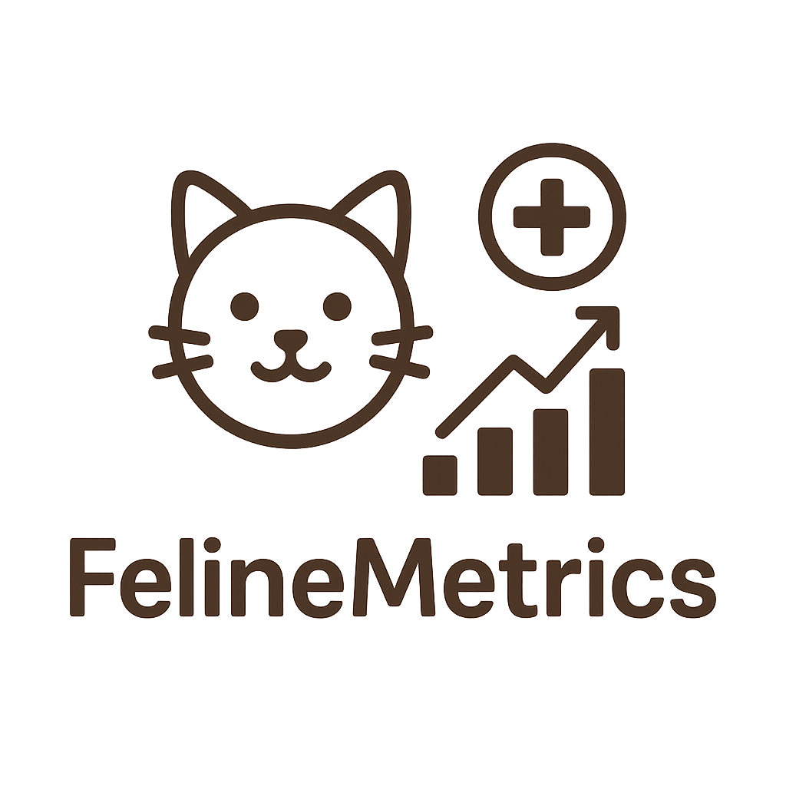
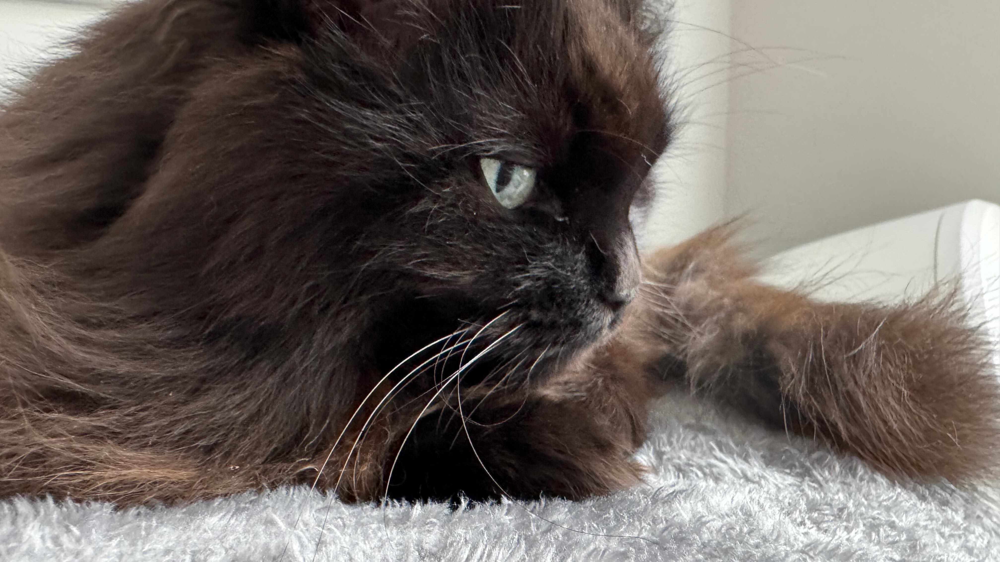

 

# FelineMetrics | Access to My Cat's Medical Records

A useful Streamlit app to ensure I have access to my cat's medical records from anywhere.  I made this after I couldn't find the notebook with over a decade of carefully maintained notes during a medical emergency after a big move!  Fortunately, Mel is ok, just a soft tissue injury to her leg, I was concerned she might have broken it!

This is still a work in progress.  Eventually, I will be able to access all her records and see useful graphs with recommended limits for bloodwork levels.  In the more distant future, it will also contain an entry to include her regularly weigh-ins.  (She has arthritis and thus must stay below 8 pounds, according to the vet!  Mel does not approve of the diet!)

Mel does _not_ approve!
